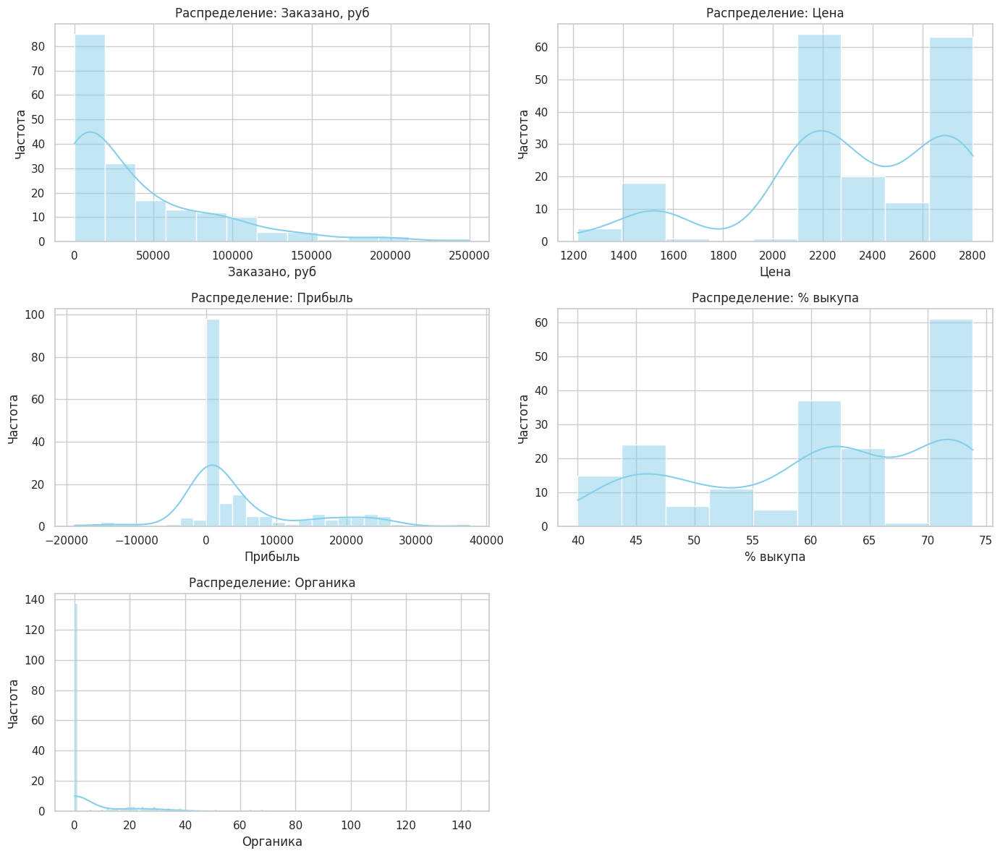
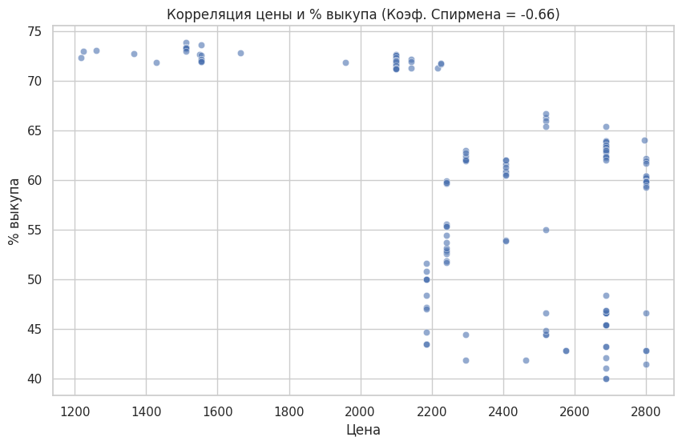
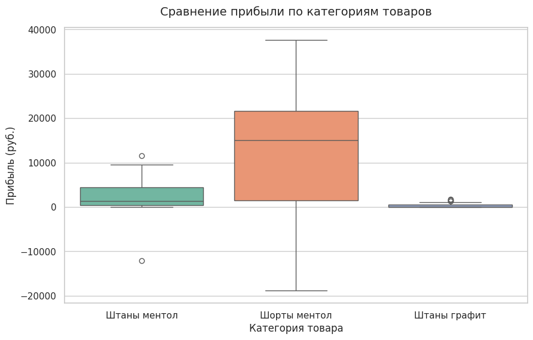

### Анализ продаж одежды на WB

Стек проекта: 
Python, pandas, numpy, scipy, scikit_posthocs,  matplotlib, seaborn. 

---
### 1. Постановка задачи
Бизнес контекст: 
Селлер одежды на Wildberries. В ассортименте представлены штаны и шорты разных цветов под брендами (kaoki) и без бренда.

Цель анализа: 
Оптимизация продуктовой линейки, оценка эффективности рекламных кампаний и акций, а также выявление неочевидных закономерностей в поведении покупателей для максимизации маржинальности.

Структура анализа:
- Влияет ли участие в акциях на реальный прирост заказов или только съедает маржу?
- Есть ли зависимость процента выкупа от установленной цены?
- Отличается ли прибыль в зависимости от дня недели (когда лучше крутить рекламу)?
- Зависит ли конверсия в заказ от типа трафика (органика vs реклама)?
- Какие товары чаще возвращают и почему?

### 2. Подготовка данных
Перед началом анализа был проведен предобработка данных в Python pandas:
- Столбец дата переведен в формат datetime, извлечены дополнительные признаки: день_недели, месяц.
- Текстовые проценты в столбцах % выкупа, Корзина (например, "73,39%") очищены от лишних символов, запятые заменены на точки и преобразованы в тип float.
- Из столбца артикул с помощью регулярных выражений выделена категория товара (Штаны, Шорты) для группировки.
- Обработаны пропуски: пустые значения в рекламных бюджетах заменены на 0 (реклама не запускалась).

### 3. Базовый анализ и проверка на нормальность

Основными метриками, участвующими в исследовании являются: 
- органика
- размер заказа в рублях
- прибыль
- процент выкупа
- цена 
- акция 

##### Проверка нормальности распределения метрик

| Показатель                    | Значение  |
| ----------------------------- | --------- |
| Количество транзакций         | 183       |
| Средний размер заказа, руб.   | 39 663.70 |
| Медианный размер заказа, руб. | 22 400.00 |
| Средняя цена, руб.            | 2 311.79  |
| Медианная цена, руб.          | 2 296.00  |
| Средняя прибыль, руб.         | 4 629.99  |
| Медианная прибыль, руб.       | 913.00    |
| Средний % выкупа              | 60.62     |
| Медианный % выкупа            | 62.12     |
| Средняя органика              | 7.20      |
| Органика (медиана)            | 0.00      |
Судя по соотношению среднего и медианы метрики могут не соответствовать нормальному распределению.
Выборка у нас небольшая, есть выбросы поэтому оптимально будет использовать тест Шапиро-Уилка для проверки нормальности распределения метрик.

*Мы проверяем гипотезу **H0**: распределение переменной не отличается от нормального.*

**Результаты проверки нормальности распределения (критерий Шапиро-Уилка)**

| Параметр | Статистика W | p-value | Нормальное распределение |
|----------|--------------|----------|-------------------------|
| Заказано, руб | 0.797007 | 1.127243e-14 | Нет |
| Цена | 0.888125 | 1.798545e-10 | Нет |
| Прибыль | 0.790095 | 6.197356e-15 | Нет |
| % выкупа | 0.892563 | 3.249074e-10 | Нет |
| Органика | 0.494785 | 1.194568e-22 | Нет |

**Выводы по результатам тестов:**
* Все анализируемые параметры **не соответствуют** нормальному распределению (p-value < 0.05 для всех показателей)
* Чем ближе значение статистики W к 1, тем ближе распределение к нормальному
* Особенно сильное отклонение от нормальности наблюдается у параметра "Органика" (наименьшее значение W и p-value)
* Полученные результаты указывают на необходимость использования непараметрических статистических методов при анализе данных

### 4. Гипотезы и их проверка

Определим уровень значимости  p-value = 0,05
___
#### Гипотеза 1. Участие в акциях влияет на количество заказов

- **Обоснование выдвижения гипотезы:** WB стимулирует своих селлеров к участию в акциях, обещая рост продаж. Проверим, реально ли в дни акций (Участие в Акции = ДА) заказывают больше штук, чем в дни без акций. 
- **H0**: Медианы количества заказов в дни акций и без акций не различаются.
- **H1**: Медиана количества заказов в дни акций статистически значимо больше, чем в дни без акций.
- **Критерий:** U-критерий Манна-Уитни (односторонний), используем т.к. распределение не нормальное, есть выбросы которые нивелируются критерием из за использования рангов. Сравниваем 2 группы.
- **Результат**: U=3883.0000, p=0.0444→ Отвергаем H0
- **Вывод:** Акции действительно статистически значимо увеличивают объем заказов. 
---
#### Гипотеза 2. Участие в акциях влияет на количество заказов

- **Обоснование выдвижения гипотезы:** Необходимо понять, влияет ли участие в акциях на размер прибыли. Это поможет оценить эффективность акционной стратегии с точки зрения фин. результатов.
- **H0**: Медианы прибыли для товаров в акциях и без акций не различаются.
- **H1**: медианы прибыли различаются.
- **Критерий:** U-критерий Манна-Уитни (двусторонний так как не уверен в направлении различий), используем т.к. распределение не нормальное, есть выбросы которые нивелируются критерием из за использования рангов. Сравниваем 2 группы.
- **Результат**: U=3883.0000, p=0.0444→ Отвергаем H0
- **Вывод:** Установлено статистически значимое различие в медианной прибыли между товарами, участвующими в акциях, и товарами без акций. Участие в акциях оказывает влияние на прибыль.

---
#### Гипотеза 3. Связь между ценой и процентом выкупа

- **Обоснование**: Есть мнение, что более дешевые товары выкупают чаще (меньше ожиданий от качества), а дорогие чаще возвращают.
- **H0:** ρ=0 — ранговая корреляция Спирмена между ценой и процентом выкупа статистически не отличается от нуля.
- **H1**: ρ=0 — между ценой и процентом выкупа существует статистически значимая ранговая корреляция. 
- **Критерий**: коэффициент Корреляция Спирмена (выбран т.к. не требует норм. распределения)
- **Результат**: ρ=-0.6580, p<0.001→ Отвергаем H0
- **Вывод**: Обнаружена умеренная отрицательная корреляция. Чем выше цена товара, тем ниже процент выкупа. Покупатели дорогих позиций более требовательны на ПВЗ.

---

#### Гипотеза 4. Зависимость прибыли от категории одежды (с Post-hoc анализом)

- **Обоснование**: Есть мнение, что более дешевые товары выкупают чаще (меньше ожиданий от качества), а дорогие чаще возвращают.
- **H0:**  М1=М2=М3 - медианы прибыли по категориям равны.
- **H1**: хотя бы одна медиана отличается от остальных.
- **Критерий**:  H‑критерий Краскела‑Уоллиса (α=0,05). При значимости проводится post‑hoc анализ с помощью критерия Данна и поправкой Бонферрони для контроля ошибки I рода при множественных сравнениях. (сравниваем 3 разные группы, распределение не нормальное)
- **Результат**: H= 48.4551, p<0.001→ Отвергаем H0
*Поскольку критерий Краскела‑Уоллиса показал статистически значимые различия между категориями (H=45,6, p<0,001), был проведён post‑hoc анализ с помощью критерия Данна с поправкой Бонферрони для контроля ошибки I рода при множественных сравнениях.*

posthoc = "Отличия не значимы (p >= 0.05)"

| Категория        | Шорты   | Штаны графит | Штаны ментол |
| ---------------- | ------- | ------------ | ------------ |
| **Шорты**        | 1.000   | < 0.001      | 0.012        |
| **Штаны графит** | < 0.001 | 1.000        | < 0.001      |
| **Штаны ментол** | 0.012   | < 0.001      | 1.000        |

Результаты попарных сравнений:
- Шорты vs Штаны графит: p < 0.001(значимо);
- Шорты vs Штаны ментол: p=0,012 (значимо);
- Штаны графит vs Штаны ментол: p < 0.001 (значимо).

- **Вывод**: все попарные различия между «Шортами» и каждой из категорий «Штаны» статистически значимы (p < 0.05, в том числе с учётом поправки Бонферрони). Различия между цветами штанов также значимы. Это говорит о том, что прибыль  различается между всеми тремя категориями, а не только «шорты vs штаны».

---
#### Гипотеза 5. Различия в органическом трафике по будням и выходным

- **Обоснование**: Понимание того, когда люди больше ищут товар сами (Органика), поможет оптимизировать включение платной рекламы.
- **H0:**  М будни=М выходные - медианное количество органических заказов в будни и выходные не различаются.
- **H1**: М будни < М выходные - в выходные медиана органических заказов статистически значимо выше (односторонняя альтернатива).
- **Критерий**:  U-критерий Манна-Уитни(односторонний) используем т.к. распределение не нормальное, есть выбросы которые нивелируются критерием из за использования рангов. Сравниваем 2 группы.
- **Результат**: U= 3519, p=0.4433→ Отвергаем H0
- **Вывод**: отсутствует статистически значимое различие в медианах будней и выходных
---
#### Гипотеза 6. Зависимость отказов от участия во внешней рекламе

- **Обоснование**: Трафик извне (например, блогеры, таргет ВК) может быть менее "прогретым", чем внутренний поиск WB, что ведет к росту пустых заказов, от которых отказываются.
- **H0:**  p внеш = p без — доли отказов в группах равны.
- **H1**: p внеш > p без — доля отказов при внешнем трафике статистически значимо выше
- **Критерий**:  z‑тест для разности двух долей (односторонний), α=0,05.
- **Результат**: Z = −3,5662, p = 0,9998.
- **Вывод**: Поскольку p>α, нет оснований отвергать нулевую гипотезу. Более того, отрицательное значение Z‑статистики указывает на то, что доля отказов в группе с внешней рекламой ниже, чем в контрольной группе. Таким образом, гипотеза о том, что внешняя реклама приводит к более высокому проценту отказов, не подтверждается данными.
---
#### Результаты проверки гипотез

| № гипотезы | Формулировка гипотезы         | Статистический критерий | p-value | Результат проверки                                      |
| ---------- | ----------------------------- | ----------------------- | ------- | ------------------------------------------------------- |
| 1          | Акции и Заказы                | 3883.0000               | 0.0444  | **Отвергаем** нулевую гипотезу (различия/связь значимы) |
| 2          | Акции и Прибыль               | 3883.0000               | 0.0887  | Нет оснований отвергнуть нулевую гипотезу               |
| 3          | Цена и % выкупа               | -0.6580                 | 0.0000  | **Отвергаем** нулевую гипотезу (различия/связь значимы) |
| 4          | Прибыль по категориям         | 48.4551                 | 0.0000  | **Отвергаем** нулевую гипотезу (различия/связь значимы) |
| 5          | Органика по будням и выходным | 3519.0000               | 0.4433  | Нет оснований отвергнуть нулевую гипотезу               |
| 6          | Внешняя реклама и Отказы      | -3.5662                 | 0.9998  | Нет оснований отвергнуть нулевую гипотезу               |

---
### 5. Выводы

#### 1. Акции: рост заказов есть, но влияние на прибыль неочевидно

**Обоснование**: Гипотеза 1 (U‑тест, p=0,0444) — акции статистически значимо увеличивают количество заказов. Гипотеза 2 (U‑тест) — значимых различий в медианной прибыли не обнаружено (p>0,05).

**Вывод**: Участие в акциях действительно стимулирует объём заказов, но это не гарантирует рост прибыли. Вероятно, скидки «съедают» маржу, а дополнительные логистические издержки при большом объёме могут нивелировать эффект.

**Рекомендации:**

- Оценивать акции не по «заказано, руб», а по прибыли и маржинальности. Ключевой KPI для акций — не объём, а итоговая прибыль на единицу товара.
- Провести A/B‑тест глубины скидки. Протестировать разные уровни скидок (например, 10%, 20%, 30%) на ограниченной выборке товаров и сравнить итоговую прибыль. Это поможет найти «оптимальную» скидку, которая даёт прирост объёма без падения маржи.
- Сегментировать товары под акции. Для товаров с низкой базовой маржой участие в акциях может быть убыточным — их лучше продвигать другими инструментами.
---
#### 2. Цена и выкуп: высокая цена снижает процент выкупа
**Обоснование**: Гипотеза 3 (корреляция Спирмена ρ=−0,6580, p<0,001) — обнаружена умеренная отрицательная корреляция между ценой и процентом выкупа.

**Вывод**: Чем выше цена товара, тем ниже процент выкупа. Покупатели дорогих позиций более требовательны при получении на ПВЗ и чаще отказываются от заказа. Это напрямую влияет на маржинальность из‑за стоимости обратной логистики.

**Рекомендации:**
- Закладывать повышенный процент отказов в юнит‑экономику для дорогих товаров. При расчёте маржи для товаров в верхнем ценовом сегменте нужно учитывать более высокий риск возврата.
- Улучшать презентацию дорогих товаров. Для позиций с высокой ценой особенно важны качественные фото, точные размерные сетки и подробные описания — это снижает неоправданные ожидания и количество отказов.
- Рассмотреть стратегию «ценового позиционирования». Если цель — максимизировать выкуп и оборачиваемость, можно протестировать смещение ассортимента в средний ценовой сегмент, где процент выкупа выше.

--- 
#### 3. Фокус на прибыльные категории: штаны приносят больше прибыли, чем шорты
**Обоснование**: 
Гипотеза 4 (Краскел‑Уоллис H=48,4551, p<0,001; post‑hoc критерий Данна с поправкой Бонферрони) — все попарные различия между категориями статистически значимы.

**Вывод**: 
Прибыль существенно различается между всеми тремя категориями: шорты приносят значимо меньше прибыли по сравнению с обеими категориями штанов, а также между цветами штанов есть значимые различия.

**Рекомендации**:
- Перераспределить рекламный бюджет в пользу штанов. Основной объём внутренней рекламы («Поиск», «Карточка») стоит направить на карточки штанов — это даст более высокую отдачу по прибыли.
- Проанализировать, почему штаны прибыльнее. Это может быть связано с более высоким процентом выкупа, меньшей долей возвратов или лучшей маржинальностью. Понимание причины поможет масштабировать успешный подход.
- Оптимизировать ассортимент шорт. Если шорты систематически менее прибыльны, стоит либо пересмотреть их ценообразование и презентацию, либо сократить долю этой категории в общем ассортименте.

---
#### 4. Стабильность спроса по дням недели: нет всплесков органики на выходных
**Обоснование**: 
Гипотеза 5 (U‑тест Манна‑Уитни, p=0,4433) — нет статистически значимых различий в медиане органического трафика между буднями и выходными.

**Вывод**: 
Органический спрос распределён равномерно в течение недели. Нет оснований считать, что покупатели активнее ищут товар на выходных.

**Рекомендации**:
- Не снижать рекламные ставки на выходные. Поскольку всплеска органики нет, сокращение рекламного бюджета в выходные может привести к потере охвата и заказов.
- Поддерживать стабильный уровень рекламы. Равномерный спрос в течение недели позволяет планировать рекламные кампании без резких колебаний ставок.

#### 5. Внешняя реклама и отказы: гипотеза о «холодной» аудитории не подтвердилась
**Обоснование**: Гипотеза 6 (z‑тест для долей, Z=−3,5662, p=0,9998) — нет оснований утверждать, что внешняя реклама приводит к более высокому проценту отказов. Более того, статистика указывает на то, что доля отказов в группе с внешней рекламой ниже.

**Вывод:** 
Данные не подтверждают предположение о том, что внешний трафик (блогеры, таргет ВК) менее «прогрет» и приводит к росту отказов. Наоборот, по статистике доля отказов ниже, хотя различие и не является статистически значимым.

**Рекомендации**:
- Продолжать использовать внешнюю рекламу как канал привлечения заказов. Нет статистических оснований отказываться от этого канала из‑за опасений по поводу роста возвратов.
- Анализировать не только отказы, но и другие метрики эффективности. Для внешней рекламы важнее смотреть на стоимость привлечения заказа, конверсию, LTV и итоговую прибыль, а не только на процент отказов.
- Тестировать разные типы креативов и форматы. Поскольку гипотеза о «завышенных ожиданиях» не подтвердилась, не стоит делать вывод о необходимости менять подачу товара только на основании процента отказов. Лучше тестировать креативы, ориентируясь на конверсию и прибыль.
---
### 6. Код 

`stat.py` - расчеты графики 
`statistical_report.txt` - краткий отчет
Примечание:
*При запуски в Google Colab требуется установить доп. пакет `!pip install scikit-posthocs`*

